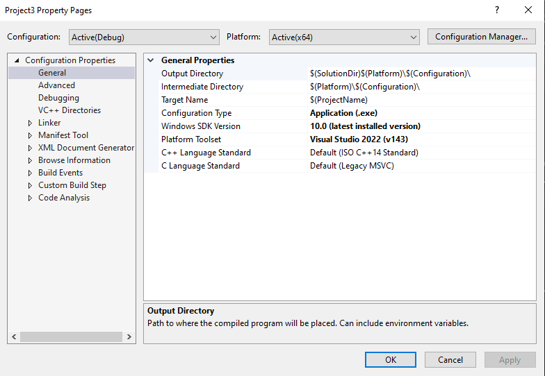

:icons: font
:data-uri:
:source-highlighter: rouge
:toc: left 
:toclevels: 4
:numbered:
:stem:
:doctype: book

= CSD1401 - Visual Studio Setup for CProcessing =

== Prerequisites

* Installed Visual Studios 2022 Community Edition. If you haven't, here are the steps to set it up:
** Click link:https://visualstudio.microsoft.com/thank-you-downloading-visual-studio/?sku=Community&rel=16[here] to download the Visual Studios 2022 installer.
** Double-click on the installer that you downloaded.
** When prompted check the box for *[Desktop development with C++]* under the *[Desktop and Mobile]* section
** Click the on *[Install/Modify]* button.

* Downloaded the `CProcessingSG.zip` zip file from the Moodle link `CProcessing Library`.
* Downloaded the `cp_vs2022_handout.zip` zip file from the Moodle link `CProcessing Setup for Visual Studios 2022 Handout`. It should contain:
** `cp_vs2022_setup.html`: This document as an offline HTML.
** `DigiPen_Singapore_WEB_RED.png`: A simple PNG image file for us to us
** `main.c`: Sample C code that will use CProcessing code to spawn a window and render `DigiPen_Singapore_WEB_RED.png` onto it.

== Project Creation

First, we will create the Visual Studios Solution and Project files that will be used to run our first application.

* Open Visual Studios. You should see a window that looks like this:

image::res/vs2022_create.png[]

* Under the [Visual Studio 2022] window:
** Click on [Create a new project]
* Under the [Create a new project] window:
** Click on [Empty Project]. Make sure that it's the C++ version. 
** Click on [Next].
* Under the [Configure your new project] page:
** (Optional) Change the [Project Name] to one of your liking.
** (Optional) Change the [Location].
** Note the [Location] as we need to navigate to it later.
** Click on [Create].

You should see Visual Studios appear on your screen, like so:

image::res/vs2022_empty.png[]

This means that it has successfully created and opened.

In this project, we will not be building for 32-bit systems, so to avoid confusion, we need to remove 32-bit system-related configurations from the project.

*	Under [Build] > [Configuration Manager] 
** Click on [Active Solution Platform] > [Edit…] > Click on [x86] > [Remove]
** Click on [Platform] > [Edit…] > Click on [Win32] > [Remove]

== Adding a folder for CProcessing and assets

Next, we will add the CProcessing library to a location within the project folder. 
This is so that our project can easily locate CProcessing's header and library files, and subsequently use its code.

* Go to the project's Solution File (.sln) using Windows Explorer. It should be at the [Location] that you set earlier.
* Create a folder named "Extern" at that location. Extern is short for "External" which means that this folder will contain code that is provided by someone else.
** Copy the CProcessing folder from the given `CProcessingSG.zip` file into the "Extern" folder.
*	Create a folder named "Assets" at that location.
**	Copy the given `DigiPen_Singapore_WEB_RED.png` file into the "Assets" folder you just created

== Project Configuration

Next, we configure the project properties. 
Right-click on the project in the Solution Explorer:

image::res/vs2022_project_properties.png[]

Then click on [Properties]. 
It should open a window that looks something like this:

This window contains all configurations of the project.

IMPORTANT: From here on, unless stated otherwise, all the settings we will make will affect both Debug and Release configurations, so make sure to set [Configurations] to *All Configurations*.

Add the additional directories the compiler needs to look for when compiling and linking:

*	Under [Configuration Properties] > [VC++ Directories]
**	Add `$(SolutionDir)Extern\CProcessing\inc` to [General] > [Include Directories]
**	Add `$(SolutionDir)Extern\CProcessing\lib\x64` to [General] > [Library Directories]

WARNING: When you add an entry into a section, you have to seperate each entry with ';'. 
For example, if the entry for [Include Directories] is: `$(VC_IncludePath);$(WindowsSDK_IncludePath)`, to add `$(SolutionDir)Extern\CProcessing\inc`, you will have to do: `$(VC_IncludePath);$(WindowsSDK_IncludePath);$(SolutionDir)Extern\CProcessing\inc`

Configure the linker to link to the appropriate CProcessing library files depending on whether we are on Debug or Release configurations:

*	Under [Configuration Properties] > [Linker] > [Input] > [Additional Dependencies]
**	With [Configuration] set to *Debug*, add `CProcessingd.lib`
**	With [Configuration] set to *Release*, add `CProcessing.lib`

Configure the character set the project is using:

*	Under [Configuration Properties] > [Advanced] > [Character Set]
**	Set to *Use Multibyte Set*

Configure the subsystem the project is using:

*	Under [Configuration Properties] > [Linker] > [System] > [Subsystem]
**	Set to *Windows (/SUBSYSTEM:WINDOWS)*

Set the output directory of the compiler where the executable will be created. 
We will set this to a folder named *bin* at the directory the Solution file is in:

*	Under [Configuration Properties] > [General] > [Output Directory]
**	Set to `$(SolutionDir)\bin\$(Configuration)-$(Platform)\`

Set the intermediate directory of the compiler. 
This is where all the 'rubbish' files that the compiler generates will go to.  
We will set this to a folder named ".tmp" at the directory the Solution file is in:

*	Under [Configuration Properties] > [General] > [Intermediate Directory]
** Set to `$(SolutionDir)\.tmp\$(Configuration)-$(Platform)\`

Set the working directory of the debugger to be in the same directory as the executables output by the compiler:

*	Under [Configuration Properties] > [Debugging] > [Working Directory]
** Set to `$(SolutionDir)\bin\$(Configuration)-$(Platform)\`

Configure the entry point to comply with CProcessing's entry point:

* Under [Configuration Properties] > [Linker] > [Advanced] > [Entry Point]
** Set to `mainCRTStartup`

Tell Visual Studios to copy the appropriate .dll and assets to where the executable is after it's done building:

* With [Configuration] set to *Debug*:
** Go to [Configuration Properties] -> [Build Events] > [Post-Build Event] > [Command Line] > Click on the [v] icon at the end of the [Command Line] entry area > [Edit...] and add the following lines in the popup window:
***	`xcopy "$(SolutionDir)Assets\*" "$(OutDir)Assets\" /s /r /y /q`
***	`xcopy "$(SolutionDir)Extern\CProcessing\lib\x64\CProcessingd.dll" "$(OutDir)" /s /r /y /q`
***	`xcopy "$(SolutionDir)Extern\CProcessing\lib\x64\fmodL.dll" "$(OutDir)" /s /r /y /q`
*	With [Configuration] set to *Release*, add the following lines:
** Go to [Configuration Properties] -> [Build Events] > [Post-Build Event] > [Command Line] > Click on the [v] icon at the end of the [Command Line] entry area > [Edit...] and add the following lines in the popup window:
***	`xcopy "$(SolutionDir)Assets\*" "$(OutDir)Assets\" /s /r /y /q`
***	`xcopy "$(SolutionDir)Extern\CProcessing\lib\x64\CProcessing.dll" "$(OutDir)" /s /r /y /q`
***	`xcopy "$(SolutionDir)Extern\CProcessing\lib\x64\fmod.dll" "$(OutDir)" /s /r /y /q`

== Running our first application 

Create a fresh CPP file with the entry point function and name it "main.c"

*	[Project] > [Add New Item..] > [C++ File]
*	Copy the code from the given "main.c" into the "main.c" file that you just created.
*	Build and run the project
*	You should see a window pop up with the singapore DigiPen logo.

If you got here, congratulations! You have set up CProcessing!
